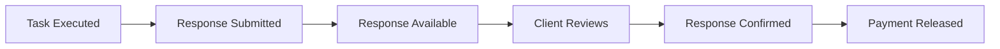

# Responses

Learn how to handle task responses on the OpenGPU network. When providers complete your tasks, they submit responses containing computed results that you can retrieve, validate, and confirm.

## 🎯 What are Responses?

**Responses** are the results returned by providers after executing your tasks. Each response contains:

- **Result Data**: The computed output from your task
- **Provider Information**: Who executed the task
- **Status Indicators**: Success/failure status
- **Timestamps**: When the work was completed
- **Confirmation State**: Whether the response has been accepted

## 🔄 Response Lifecycle



1. **Execution**: Provider completes your task
2. **Submission**: Provider submits response to network
3. **Availability**: Response becomes available for retrieval
4. **Review**: You can check and validate the response
5. **Confirmation**: You confirm the response as acceptable
6. **Payment**: Provider receives payment for completed work

## 📋 Response Components

### Response Data Structure
```python
class TaskResponse:
    address: str           # Unique response identifier
    provider: str          # Provider wallet address
    data: str             # The actual result data
    status: str           # "submitted" or "confirmed"
    confirmed: bool       # Whether response is confirmed
    timestamp: int        # When response was submitted
```

### Response States

- **🟡 Submitted**: Response submitted but not yet confirmed
- **✅ Confirmed**: Response accepted and payment released

## 🚀 Quick Example

Here's how to retrieve and confirm a response:

```python
import ogpu.client

# Get all responses for your task
task_address = "0x1234567890abcdef..."
responses = ogpu.client.get_task_responses(task_address)

print(f"📨 Found {len(responses)} responses")

# Check for confirmed response
confirmed = ogpu.client.get_confirmed_response(task_address)
if confirmed:
    print(f"✅ Confirmed result: {confirmed.data}")
else:
    print("⏳ No confirmed response yet")
    
    # Confirm the first submitted response
    for response in responses:
        if response.status == "submitted" and not response.confirmed:
            confirmation_tx = ogpu.client.confirm_response(response.address)
            print(f"✅ Response confirmed: {confirmation_tx}")
            break
```

## 📊 Response Types

### Automatic vs Manual Confirmation

Depending on your source configuration, responses can be handled differently:

#### Automatic Confirmation (`FIRST_RESPONSE`)
```python
# In your source configuration
deliveryMethod=ogpu.client.DeliveryMethod.FIRST_RESPONSE
```
- First successful response is automatically confirmed
- Faster task completion
- Best for deterministic tasks

#### Manual Confirmation (`MANUAL_CONFIRMATION`) 
```python
# In your source configuration  
deliveryMethod=ogpu.client.DeliveryMethod.MANUAL_CONFIRMATION
```
- You must manually confirm responses
- Allows quality review before payment
- Best for creative or subjective tasks

## 🎯 Key Operations

### 📥 **Retrieve Responses**
Get all submitted responses for your tasks
```python
responses = ogpu.client.get_task_responses(task_address)
```

### ✅ **Confirm Responses** 
Accept a response and release payment
```python
ogpu.client.confirm_response(response_address)
```

### 🔍 **Monitor Status**
Check if any response has been confirmed
```python
confirmed = ogpu.client.get_confirmed_response(task_address)
```

## 🎯 Next Steps

### Response Management Guides

- **[📥 Retrieving Responses](retrieving-responses.md)** - Learn how to fetch and monitor task responses
- **[✅ Confirming Responses](confirming-responses.md)** - Validate and confirm responses to complete tasks

Ready to handle your task responses! 📨
