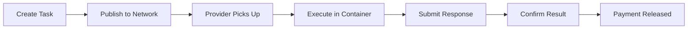

# Tasks

Learn how to publish and manage computational tasks on the OpenGPU network. Tasks define what work you want providers to execute and how results should be delivered.

## 🎯 What is a Task?

A **Task** represents a single computational job that gets executed on the OpenGPU network. It specifies:

- **Source**: Which service/container to use for execution
- **Input Data**: The data and parameters for processing  
- **Payment**: How much to pay providers
- **Expiry**: How long the task remains valid
- **Delivery**: How results are confirmed and delivered

## 🔄 Task Lifecycle



1. **Create**: Define task parameters and input data
2. **Publish**: Submit task to the blockchain
3. **Execute**: Network providers run your task
4. **Respond**: Providers submit results
5. **Confirm**: Results are validated and confirmed
6. **Complete**: Payment is released to providers

## 🚀 Quick Start

Get started with tasks in just a few steps:

```python
import ogpu.client
from web3 import Web3

# 1. Configure chain
ogpu.client.ChainConfig.set_chain(ogpu.client.ChainId.OGPU_TESTNET)

# 2. Create task
task_info = ogpu.client.TaskInfo(
    source="0x4F1477E0a1DA8340E964D01e32Dff302F3CB203A",
    config=ogpu.client.TaskInput(
        function_name="text2text",
        data={"messages": [{"role": "user", "content": "Hello!"}]}
    ),
    expiryTime=int(time.time()) + 600,
    payment=Web3.to_wei(0.01, "ether")
)

# 3. Publish task
task_address = ogpu.client.publish_task(task_info)
print(f"✅ Task published: {task_address}")
```

## 📚 Task Types

### 💬 Text Processing
- **AI Chat**: Conversational AI and question answering
- **Text Analysis**: Sentiment, summarization, translation
- **Content Generation**: Articles, code, creative writing

### 🖼️ Media Processing  
- **Image Analysis**: Object detection, classification
- **Image Generation**: AI art, photo editing
- **Video Processing**: Transcription, analysis

### 🧮 Computational Tasks
- **Data Analysis**: Statistical processing, modeling
- **Scientific Computing**: Simulations, calculations
- **Batch Processing**: Large-scale data transformation

## 🛠️ Core Components

### TaskInfo Structure
```python
ogpu.client.TaskInfo(
    source="0x...",              # Source address
    config=TaskInput(...),       # Function and data
    expiryTime=timestamp,        # When task expires
    payment=wei_amount           # Payment in wei
)
```

### Function Mapping
Tasks call specific functions in your published sources:
```python
# Your service function
@ogpu.service.expose()
def text2text(input_data: InputData) -> Message:
    # Implementation here
    pass

# Task configuration
config = TaskInput(
    function_name="text2text",   # ← Matches function name
    data={...}                   # ← Matches InputData structure
)
```

## 🎯 Task Categories

### By Complexity

| Type | Duration | Payment Range | Examples |
|------|----------|---------------|----------|
| **Simple** | < 5 min | 0.001-0.005 OGPU | Basic Q&A, simple text |
| **Medium** | 5-30 min | 0.005-0.02 OGPU | AI inference, analysis |
| **Complex** | 30+ min | 0.02-0.1 OGPU | Heavy compute, batch jobs |

### By Use Case

- **🔍 Research**: Data analysis, scientific computing
- **🎨 Creative**: Content generation, design
- **🤖 AI/ML**: Model inference, training
- **📊 Business**: Report generation, automation

## 🌟 Key Features

### ⚡ **Fast Execution**
Tasks are picked up quickly by available providers

### 💰 **Competitive Pricing** 
Pay only for successful task completion

### 🔒 **Secure & Trustless**
Blockchain-based payments and verification

### 🌍 **Global Network**
Access to worldwide distributed computing

### 📈 **Scalable**
Handle single tasks or large batch operations

## 🎯 Getting Started

Choose your path:

### 🚀 **Quick Publishing**
Jump straight to creating tasks
- **[Publishing Tasks](publishing-tasks.md)** - Step-by-step publishing guide

### ⚙️ **Detailed Configuration**  
Learn advanced task configuration
- **[Task Configuration](configuration.md)** - Complete configuration guide

### 📊 **Response Handling**
Manage task results
- **[Responses Overview](../responses/index.md)** - Handle task outputs

## 💡 Best Practices

### Task Design
- **Clear Requirements**: Define specific, measurable outputs
- **Appropriate Timeouts**: Allow sufficient processing time
- **Fair Payment**: Match payment to task complexity

### Data Structure
- **Validate Locally**: Test your function and data structure first
- **Use Pydantic**: Leverage type safety for data models
- **Handle Errors**: Design graceful error handling

### Cost Optimization
- **Batch Similar Tasks**: Group related work together
- **Right-size Payments**: Don't overpay for simple tasks
- **Monitor Performance**: Track task success rates

## 🎯 Next Steps

- **[Task Configuration](configuration.md)** - Detailed parameter configuration
- **[Publishing Tasks](publishing-tasks.md)** - Complete publishing workflow
- **[Task Templates](templates/index.md)** - Ready-to-use configurations for popular sources
- **[Responses Overview](../responses/index.md)** - Handle task results

Ready to run your first task! 🚀
